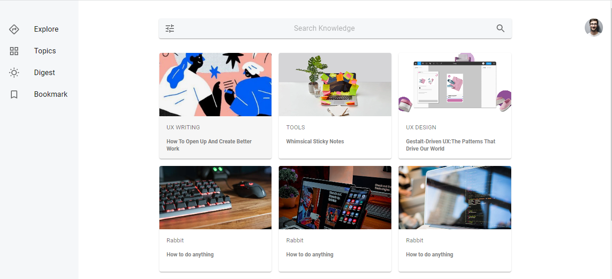

# PhotoList

1. UI to display different articles to browse into in a list format.
2. A Search bar to search contents.
3. A Sidebar to browse into different sections of WebApp.

## ScreenShot

## Installation and Setup Instructions

Clone down this repository. You will need node and npm installed globally on your machine.

Installating dependencies:

npm install

To Run Test Suite:

npm test

To Start Server:

npm start

To Visit App:

localhost:3000
